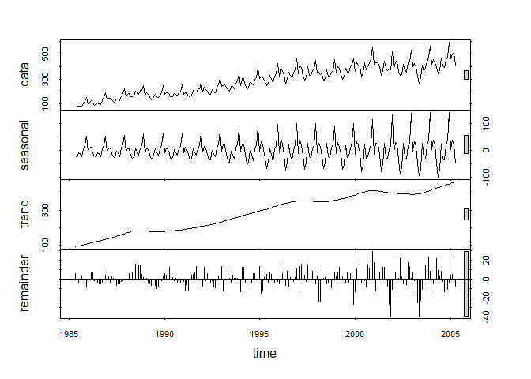

# VisitorsTSAnalysis
Sandhya Amaresh  
July 20, 2016  


## R Markdown
#### This is a R Markdown file to plot the TS for the Visitors dataset
#### Plot the time series. Can you identify seasonal fluctuations and/or a trend?

```r
library(fpp)
```

```
## Warning: package 'fpp' was built under R version 3.3.1
```

```
## Loading required package: forecast
```

```
## Warning: package 'forecast' was built under R version 3.3.1
```

```
## Loading required package: zoo
```

```
## Warning: package 'zoo' was built under R version 3.3.1
```

```
## 
## Attaching package: 'zoo'
```

```
## The following objects are masked from 'package:base':
## 
##     as.Date, as.Date.numeric
```

```
## Loading required package: timeDate
```

```
## This is forecast 7.1
```

```
## Loading required package: fma
```

```
## Warning: package 'fma' was built under R version 3.3.1
```

```
## Loading required package: tseries
```

```
## Warning: package 'tseries' was built under R version 3.3.1
```

```
## Loading required package: expsmooth
```

```
## Warning: package 'expsmooth' was built under R version 3.3.1
```

```
## Loading required package: lmtest
```

```
## Warning: package 'lmtest' was built under R version 3.3.1
```

```r
data("visitors")
plot(visitors)
```

<!-- -->
#### Observation - we see an upward trend in the visitors, with seasonsal fluctuations, so the visitors ####increases in summer months and dip in winter months

#### Use a classical decomposition to calculate the trend-cycle and seasonal indices. 
#### Do the results support the graphical interpretation from part (a)? 

```r
fitd <- decompose(visitors)
plot(fitd)
```

<!-- -->
#### Yes , we see and upward trend in the visitor count from 1985 to 2016


####Compute and plot the seasonally adjusted data.

```r
eeadj <- seasadj(fitd)
plot(eeadj)
```

<!-- -->
#### Change one observation to be an outlier (e.g., add 500 to one observation), and recompute the seasonally adjusted data. What is the effect of the outlier? 

```r
visitors2 <- ts(c(visitors[1:54],visitors[55]+200,visitors[56:240]),start=c(1985,5),frequency=12)
plot(visitors2)
```

<!-- -->

```r
fitd2 <- decompose(visitors2)
eeadj2 <- seasadj(fitd2)
plot(eeadj2)
```

<!-- -->

```r
plot(eeadj)
lines(eeadj2,type="l",col="red")
```

<!-- -->
#### Does it make any difference if the outlier is near the end rather than in the middle of the time series? 

```r
visitors3 <- ts(c(visitors[1:239],visitors[240]+200),start=c(1985,5),frequency=12)
fitd3 <- decompose(visitors3)
eeadj3 <- seasadj(fitd3)
plot(eeadj3)
lines(eeadj2,type="l",col="red")
```

<!-- -->
####The outlier in the end is plotted in black and the outlier in middle is plotted in red, we see that there ####is not much difference, except there is an increase in the middle in the 1st scenario and increase in the 
####end in the 2nd scenario

####Now use STL to decompose the series. 

```r
fit <- stl(visitors, s.window=5)
plot(fit)
```

<!-- -->

```r
plot(visitors, col="gray",
      main="Visitors",
      ylab="New Visitors", xlab="")
lines(fit$time.series[,2],col="red",ylab="Trend")
```

<!-- -->
